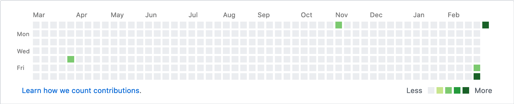

# Committed to code

> Activity on the timeline is an important indicator for recruiters

I think this is funny and that it can be bypassed easily.
Thinking about a pet project anyway, I started this ``committed-to-code``,
also to get back into Java. 

## Installation
To install, simply clone the repository,
and have maven do the job of downloading dependencies
and compiling the JAR file.
```shell script
$ git clone https://github.com/flxw/committed-to-code
$ cd committed-to-code
$ mvn package
```

### Setup
Adapt `application.ini` to your needs.
An exemplary configuration might look like this
```ini
[GENERAL]
REPODIRECTORY=testrepo
STARTDATE=2019-03-07
ENDDATE=2019-11-10
BREAK_DAYS=120

[USER]
NAME=John Doe
EMAIL=j.doe@doemail.com

[FREQUENCY]
LOWER=1
UPPER=5
```

## Usage
After compiling the JAR file and setting the configuration options,
simply execute the program like this:
```shell script
$ java -jar committed-to-code-1.0.jar -c <your-configuration-file>
```